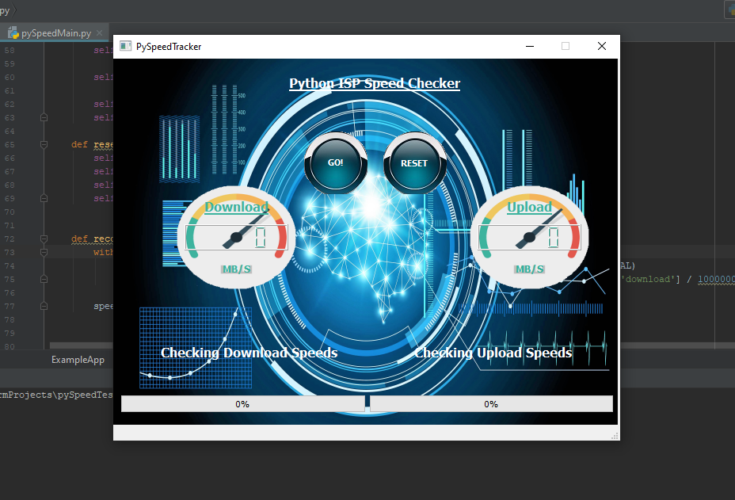

# iSpeed
 Python Based Internet Speed tester
 
 
 ## Usage instructions
 Install Python 3.6
 Install from reqs.txt with  > install -r reqs.txt
 Enjoy!
 
 ##Modification Instructions
 You can change the speed.py file which contains the gui layout directly, or you can change the speed.ui file. 
 If you change the speed.ui file with Qt Creator, You need to convert it with 
 
import os
import sys
print("converting ui to py")

try:
    os.system("<path to pyuic5.exe>\\pyuic5.exe <path to speed.ui file>\\speed.ui -o <where you want to output the speed.py file at>\\speed.py")

    print("Conversion complete")
except:
    print("Unable to execute command")
    

